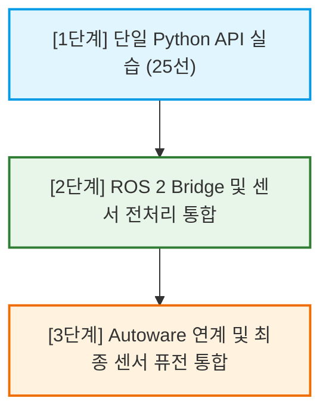

# 자율주행 센서 퓨전 실습 과정 전체 강의 요약 노트

본 문서는 CARLA 시뮬레이터와 ROS 2, 그리고 Autoware를 연계하여 센서 데이터의 획득, 전처리, 통신 및 정합을 수행하는 **자율주행 센서 퓨전 실습 과정(1~3단계)**의 전체 강의 내용 요약서입니다.

---

## 🎯 전체 실습 교육 과정 로드맵



---

## 1. [1단계] 단일 Python API 실습 (25선)

1단계에서는 외부 통신 미들웨어(ROS 2) 개입 없이, **CARLA Python API**를 단독으로 활용하여 시뮬레이터 통제, 센서 탑재, 기초 데이터 처리 및 수학적 공간 투영을 구현합니다.

### A. 시뮬레이터 연결 및 액터 제어 (01~07번 스크립트)
* **API 연결**: 시뮬레이터 서버(`2000` 포트)에 클라이언트를 연결하고, 에고 차량을 스폰한 뒤 오토파일럿(`Traffic Manager`)을 활성화합니다.
* **Spectator 고정 및 자동 추적**: 에고 차량의 전후방 상대 위치 관계 벡터를 실시간 기하 연산하여 Spectator 카메라가 차량을 부드럽게 추종하도록 구현합니다.

### B. 카메라 & 라이다 기본 가공 (08~14번 스크립트)
* **카메라 데이터**: BGRA raw 바이트 배열을 받아 Alpha 채널을 분리하고 BGR OpenCV 행렬로 재조립 및 수동 90도 회전을 수행합니다.
* **라이다 데이터**: Point Cloud 데이터를 3D 시각화(Crop Box 필터링 포함)하고, NumPy Boolean Masking 기법을 사용하여 전방 관심 구역(ROI) 이외의 점을 차단합니다.

### C. 센서 정합 및 수학적 투영 퓨전 (15~22번 스크립트)
* **좌표계 및 축 변환 (중요)**:
  - **CARLA(LHS 왼손 좌표계)**: $X$(전방), $Y$(우측), $Z$(상방)
  - **ROS/Autoware(RHS 오른손 좌표계)**: $X$(전방), $Y$(좌측), $Z$(상방)
  - 통신 정합을 위해 Y 좌표의 부호를 반전($Y_{ros} = -Y_{carla}$)시켜 줍니다.
* **내/외부 행렬 투영 (Camera Intrinsic/Extrinsic Projection)**:
  - 카메라의 렌즈 초점거리($f_x, f_y$) 및 광학 주점($c_x, c_y$) 행렬과 라이다-카메라 간의 Extrinsic 변환 행렬을 적용하여, 3D 공간상의 라이다 점구름을 카메라 2D 이미지 좌표계 상의 격자로 매핑합니다.
* **동기식 매칭**: fixed delta time 설정을 동기화하여 카메라 이미지와 라이다 프레임의 타임스탬프 오차를 일치시킵니다.

### D. 데이터 직렬화 및 소켓 통신 (23~25번 스크립트)
* **메모리 직렬화**: NumPy 배열 데이터를 파일 및 전송용 1차원 이진 바이트 스트림으로 변환(`tobytes()`)하여 UDP 루프백 통신으로 실시간 전송합니다.
* **수동 역직렬화**: 수신된 바이트 스트림을 Hex Dump 형태로 패킷 정합성을 분석하고, 메모리 캐스팅을 통해 원형 영상으로 실시간 복구 렌더링합니다.

---

## 2. [2단계] ROS 2 Bridge 및 센서 전처리 가공 통합

2단계에서는 자율주행 프레임워크 규격에 맞추어 **ROS 2 Humble/Foxy** 미들웨어를 도입하고, 센서 데이터를 노드 간 토픽 형식으로 유통 및 정제하는 파이프라인을 구축합니다.

### A. CARLA-ROS-Bridge 서브 패키지 역할
* **`carla_common`**: 좌표 변환 및 기본 인터페이스를 공유하는 유틸리티 패키지.
* **`carla_msgs`**: 차량 제어, 스포너 상태, 충돌/차선 이탈 등 CARLA 특화 커스텀 메시지(`.msg`) 규격 정의.
* **`carla_ros_bridge`**: 양방향 데이터 중계 및 동기식 모드(Sync Mode) 통제 패키지.
* **`carla_spawn_objects`**: `objects.json` 설정을 참조하여 차량 및 서라운드 센서들을 시뮬레이터 상에 일괄 자동 스폰하고 TF(좌표계 트리)를 구축.
* **`carla_manual_control`**: Pygame 수동 주행 노드 및 Telemetry HUD 가시화 노드 제공.

### B. Custom 센서 전처리 패키지 (`ros2_sensor_processing`)
* **`camera_pipeline_node`**: BGR 원시 영상에서 Grayscale 변환 후 Canny Edge로 흑백 외곽선 검출 가공 처리를 거쳐 `/processed/camera/image`로 재발행합니다.
* **`lidar_filter_create_cloud_node`**: 수신 헤더를 파싱하여 **XYZIRC(24바이트/점 고정밀 라이다 규격)** 포맷인지 정합성 검증을 거친 후, 전방 20m/좌우 8m Crop Box ROI 마스킹 및 3:1 균등 데시메이션 다운샘플링을 거쳐 `/processed/lidar/points`로 토픽을 발행합니다.

---

## 3. [3단계] Autoware 연계 및 센서 퓨전 통합

3단계에서는 실제 자율주행 플랫폼인 **Autoware**와 시뮬레이터를 완벽히 연결하여, 전처리된 고정밀 센서 토픽과 차량 모델 정보를 Autoware에 이식하고 최종 센서 퓨전 자율주행 기동을 검증합니다.

### A. Autoware 파라미터 연동 구조 (`autoware-carla.yaml`)
* **역할**: 시뮬레이션상의 에고 차량 정보, 센서 토픽 맵핑 관계, 그리고 센서 퓨전용 프레임 ID 등을 Autoware 환경에 맞도록 정의해 주는 통합 설정 프로파일입니다.
* **주요 내용**:
  - LiDAR 프레임 및 카메라 프레임의 고정 변환(Static TF) 파라미터 값 매칭.
  - 차량의 휠베이스, 트레드 및 최대 조향각 등 물리 주행 한계 상수 설정.

### B. Autoware 인터페이스 통합 런치 (`autoware_carla_interface.launch.xml`)
* **동작 원리**: XML 기반 런치 파일 내부에서 YAML 속성을 정적 로드하여 구동됩니다.
* **기능**:
  - 시뮬레이터 및 전처리 패키지로부터 들어오는 토픽들을 Autoware가 이해할 수 있는 `/sensing/lidar/rectified/pointcloud` 및 `/sensing/camera/traffic_light/image_raw` 등의 표준 토픽 경로로 리맵핑하여 입력으로 공급합니다.
  - Autoware가 최종적으로 내리는 차량 조향/속도 제어 명령(`/control/command/control_cmd`)을 수신하여 시뮬레이터용 `CarlaEgoVehicleControl`로 포워딩합니다.

---

## 💡 자율주행 핵심 개발 Cheatsheet (핵심 연산식)

### 1. 카메라 raw 바이트 배열 역직렬화 (NumPy)
```python
# 1차원 이진 바이트 스트림 복구 (RGBA/BGRA)
raw_buf = np.frombuffer(carla_image.raw_data, dtype=np.uint8)
bgra_matrix = raw_buf.reshape((carla_image.height, carla_image.width, 4))
bgr_matrix = bgra_matrix[:, :, :3]  # OpenCV 사용을 위해 BGR 3채널 슬라이싱
```

### 2. 라이다 raw 바이트 배열 역직렬화 & 좌표계 변환
```python
# [X, Y, Z, Intensity] 4필드 float32 배열 복원
raw_points = np.frombuffer(carla_lidar.raw_data, dtype=np.float32).reshape(-1, 4)
# LHS(CARLA) -> RHS(ROS 2/Autoware) 부호 반전
raw_points[:, 1] = -raw_points[:, 1]
```
